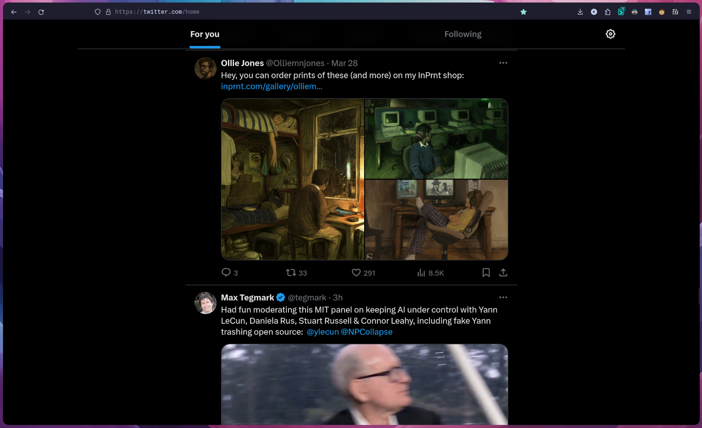

# Custom Firefox CSS

Comfy, simplistic Firefox CSS override. The tab bar is hidden, vertical tabs should be instead. This setup aims to achieve a clutter-free browsing experience.

Relies on a color theme that uses an unified background color on tab bar and toolbar. [MinimalistFox themes](https://github.com/canbeardig/MinimalistFox) are highly recommended.

